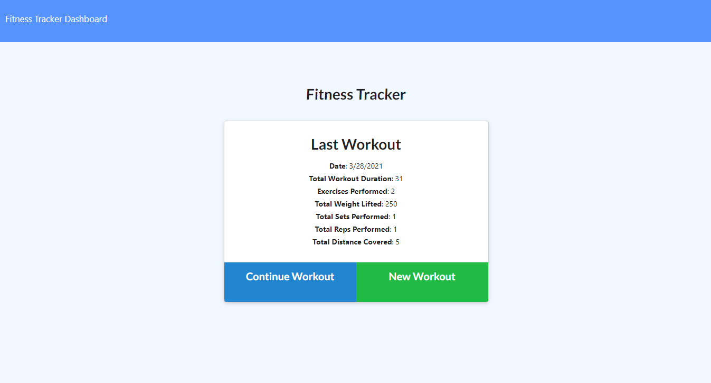
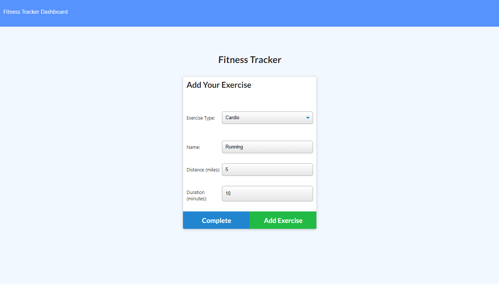

# Workout-Tracker

## Table of Contents

1. [Description](#Description)
2. [Languages and Technologies Used](#Languages-and-Technologies-Used)
3. [Installation](#Installation)
4. [Usage](#Usage)
5. [Screencaps](#Screencaps)
6. [Deployed App](#Deployed-App)
6. [Questions](#Questions)
<br/>
<br/>

## Description

This is an app that allows the user to create and track daily workouts.  The user is able to log multiple workouts on a given day.  It tracks the name of the workout and the type of workout, either resistance or cardio.  If the type of workout is resistance, it tracks the weight lifted, number of sets, number of reps, and the duration of the exercise.  If the type of workout is cardio, it tracks the distance traveled and the duration of the exercise.  The user is also able to see all of the workouts that have been completed in the past seven workouts via the dashboard.

When the user visits the landing page for the app, he/she is presented with the information for the last workout completed.  Then, the user can choose to continue the last workout or create a new workout.  If the user continues the last workout, he/she is sent to the exercise page where he/she can add exercises to the workout and complete the workout upon adding additional exercises.  If the user chooses to create a new workout, he/she is sent to the exercise page where he/she can add exercises and complete the workout.
<br/>
<br/>

## Languages and Technologies Used

* HTML
* CSS
* JavaScript
* Node.js
* Express
* MongoDB
* Mongoose
* Heroku

This app is a full-stack solution using HTML, CSS, and Javascript to create the client side.  The server side is built with Node.js, using the Express npm package and also the Mongoose npm package to interact with the MongoDB database.  The app is deployed on Heroku, using a MongoDB Atlas cluster for database storage.
<br/>
<br/>

## Installation

To run the app locally on your PC in development mode, do the following:

1. Install [MongoDB](https://www.mongodb.com/) on your PC.
2. Clone the [repository](https://github.com/BrienBarr/Workout-Tracker) to your PC.
3. Open the local directory to where you cloned the repository in the command line/terminal.
4. Run the npm i command from the command line/terminal.
```
npm i
```
<br/>
<br/>

## Usage

From the command-line/terminal, run the "mongod" command to start MongoDB.
```
mongod
```

In a different instance of the command-line/terminal, run the "npm run seed" command to seed the MongoDB database with some useable data.
```
npm run seed
```

Then, run the "npm start" command to start the app.
```
npm start
```

Open up a web browser and go to [http://localhost:3000/](http://localhost:3000/).  This will take you to the client side landing page for the app.

On the left of the top nav bar, there is a link to homepage of the app and a link to the stats page where the user is presented with a dashboard showing the stats of the last seven workouts.

In the container div in the middle of the page, the user is shown the stats of the most recent workout.  Under the stats are buttons for the user to continue the most recent workout or create a new workout.  If the user continues the most recent workout, he/she can add exercises to the workout and, then, complete the workout.  If the user chooses to create a new workout, he/she can add exercises to and complete the new workout.

<br/>
<br/>

## Screencaps

<br/>
The landing page of the app<br/><br/>



<br/>
Adding a resistance exercise to the current or new workout<br/><br/>


<br/>
Adding a cardio exercise to the current or new workout<br/><br/>



<br/>
The dashboard showing the stats of the last seven workouts<br/><br/>


<br/>
<br/>

## Deployed App

See the deployed app in action on Heroku [here](https://protected-dusk-68194.herokuapp.com/)!

<br/>
<br/>

## Questions

[GitHub/BrienBarr](https://github.com/BrienBarr)<br/>
For additional questions, e-mail me at: [brien.barr3320@gmail.com](brien.barr3320@gmail.com)